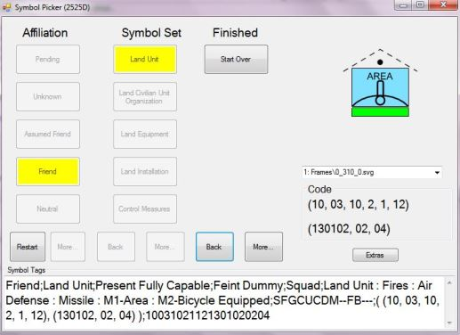

# Military Symbols .NET 

A MIL-STD-2525D Data Model and Drawing Library written in C#.

## Features

* A sample data model that corresponds to the MIL-STD-2525D symbol set
* Convert to/from MIL-STD-2525C (Charlie)
* Export symbols as bitmaps (if dependent SVG files are present [see instructions below](#instructions) ) 
    * Line and area symbols are only their example/notional versions
* A sample search/query capability
* Samples demonstrating the above

## Requirements

*  To Build
    * VS2012 (or later)
    * Source SVG files (link to these files in the [instructions below](#instructions))
* To Run
    *  To run the [sample deployment](./Deployment), you will need the .NET Framework 4.5 installed (and something to unzip the deployment)

## Instructions

### Obtain Prerequisites/Dependencies

* IMPORTANT: The drawing portions of this app depend on a set of SVG image files provided at https://github.com/Esri/joint-military-symbology-xml/ 
    * The drawing portion of this app will not be functional without these image files.
    * These files may be [obtained from here](https://github.com/Esri/joint-military-symbology-xml/tree/master/svg)
    * Unzip the files from the set above
* To make these svg files available to the sample applications either 
    * Change the app.config setting for SVGImagesHome
    * You can also change the default location in the source 
        * Just update their location in file: [MilitarySymbolToGraphicLayersMaker.cs](./MilitarySymbols/MilitarySymbolToGraphicLayersMaker.cs) and rebuild the project

### Building

* Build the source solution .sln in Visual Studio

### Running

* Run one of the sample apps under [Samples](./Samples)
    * [MilSymbolPicker](./Samples/MilSymbolPicker) - (Form App) Search and draw symbols using human readable names or manually enter a code to view its image/attributes.
    * [ConvertCode](./Samples/ConvertCode) - (Console App) Converts ID Code between standards -  MIL-STD-2525C - Charlie(C) and MIL-STD-2525D - Delta(D) (and visa-versa).
    * [ExportBitmap](./Samples/ExportBitmap) - (Console App) Exports ID Code (2525C or 2525D) to bitmap. Also exports all known 2525C or 2525D symbols if "ALL" or "ALL2525C" option used.
    * [CodePermutations](./Samples/CodePermutations) - (Console App) Generates all valid code/attribute combinations of a symbol. Generates random symbols.

## Notes

This started out as just a quick prototype so I could learn MIL-STD-2525D (Delta), test/validate the data provided in the standard, and prototype simple API/method calls. It's still pretty much in the prototype/beta stage but providing it as a stand-alone repo in case it is of help to any others (and anyone wants to help refine). There are likely many Military Symbol APIs out there, but I was mainly aiming for simplicity and a few focused apps.

This repo/data has **not** been heavily validated/tested, so please keep this in mind when considering where it is appropriate to use. 

## Licensing

Licensed under the Apache License, Version 2.0 (the "License");
you may not use this file except in compliance with the License.
You may obtain a copy of the License at

   http://www.apache.org/licenses/LICENSE-2.0

Unless required by applicable law or agreed to in writing, software
distributed under the License is distributed on an "AS IS" BASIS,
WITHOUT WARRANTIES OR CONDITIONS OF ANY KIND, either express or implied. See the License for the specific language governing permissions and
limitations under the License.

## Credits

This project uses:

1. SVG and data files from https://github.com/Esri/joint-military-symbology-xml/ 
    1. Governed by the [Apache License, Version 2.0](http://www.apache.org/licenses/LICENSE-2.0)

1. The C# SVG Rendering Engine (current Github forked repo below)
    1.  The C# SVG Rendering Engine is governed by the Microsoft Public License: https://svg.codeplex.com/license
    1.  For more information see the project pages at:
        1.  http://svg.codeplex.com/
        1.  https://github.com/vvvv/SVG 
